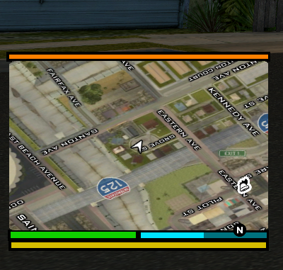
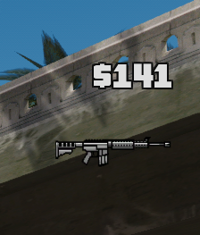
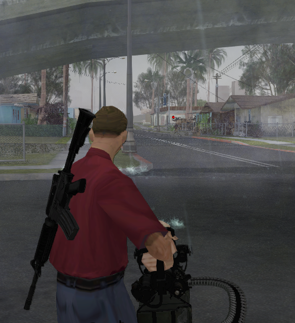
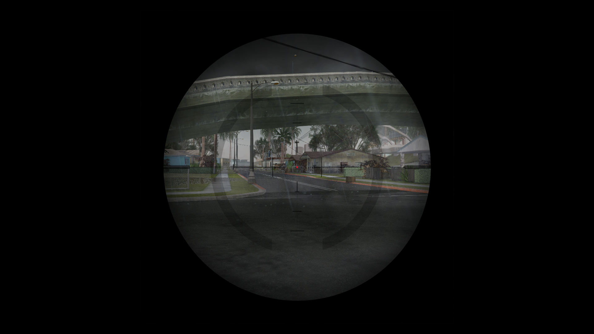
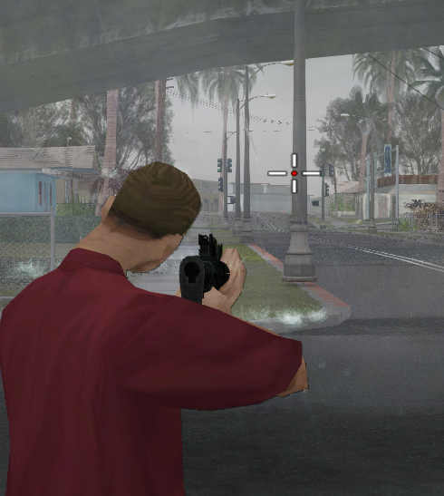
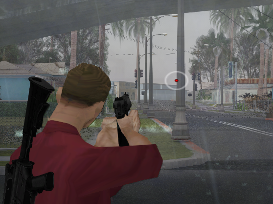
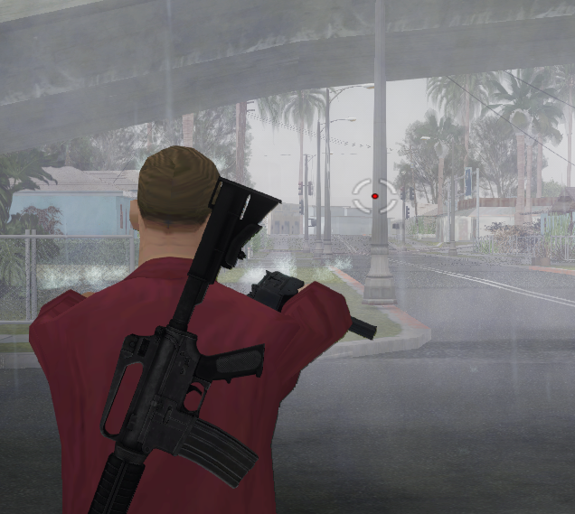

# HUD SAMP GTA

This project is a custom HUD modification for **Grand Theft Auto: San Andreas**, with support for the **San Andreas Multiplayer (SA-MP)** environment. It contains the main HUD files, configuration data, visual assets, plugins, and CLEO scripts used to customize the in-game interface.

### SA-MP compatibility notice

These HUD changes are designed to work with **San Andreas Multiplayer (SA-MP) only**. They are not intended for the standard single-player version of GTA San Andreas or other multiplayer modifications. Correct operation requires a compatible SA-MP installation and the required HUD files to be placed in their proper game directories.

### Important files

```
file/
├── HUD/
│   ├── ARZ.plugins
│   ├── config.json
│   ├── OUSSFAB.HUD
│   └── SAMP.plugin
├── cleo
│   └── Show only necessary hud.cs
├── HUD.asi
└── LUA.DLL

```

## Installation

1. Download the compressed project archive.
2. Extract the archive using a tool such as 7-Zip or WinRAR.
3. Open the extracted project folder.
4. Select the included files and folders, including `HUD`, `cleo`, `HUD.asi`, and `LUA.DLL`.
5. Copy them directly into the main **GTA San Andreas game directory**. This is the folder that contains `gta_sa.exe`.
6. If Windows asks whether you want to merge folders or replace existing files, confirm the operation.
7. Start the game through **SA-MP** and check that the custom HUD is active.

> **Important:** Do not place the extracted project inside an additional nested folder. The contents of the archive must be copied directly into the GTA San Andreas installation directory. Create a backup of your original game files before installing the modification.

## CLEO Script: `cleo/Show only necessary hud.cs`

`Show only necessary hud.cs` is a compiled CLEO script included in the project to provide a simple weapon-change notification. Its purpose is to show only the necessary weapon information without keeping the weapon image permanently visible on the screen.

## HUD Components: `HUD.asi` and `LUA.DLL`

`HUD.asi` and `LUA.DLL` are the main components responsible for applying the custom HUD changes in the game. Together with the files in the `HUD/` directory, they modify the position and appearance of several SA-MP interface elements.

### Main HUD changes

The HUD modification provides the following improvements:

- Changes the position of the in-game map so it fits the custom HUD layout.
- Improves the visual presentation of the money indicator.
- Improves the weapon and ammunition indicators, making them clearer and better aligned with the rest of the interface.
- Improves the wanted-level display and police star indicators.
- Replaces the shop and mission icons with high-quality icons that are clearer and more detailed.
- Changes the crosshair according to the type of weapon currently equipped.

### Weapon-specific crosshairs

When the player equips a weapon, the HUD selects the crosshair that matches that weapon category. This makes aiming more consistent with the weapon being used and gives each weapon type a more distinct visual identity. The crosshair is updated automatically when the player changes weapons.

### Image preview

#### Map position



#### Money and ammunition



#### Weapon crosshairs











### In Game Preview

(Img/8.png)
